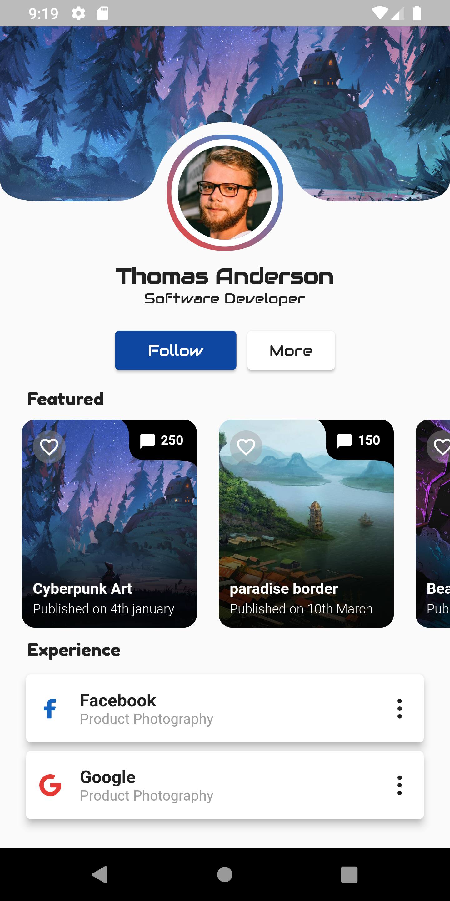
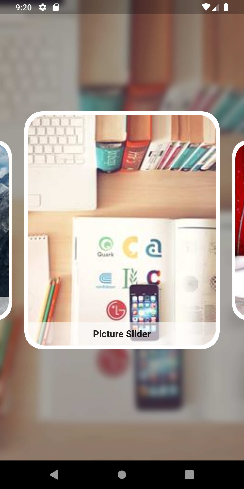
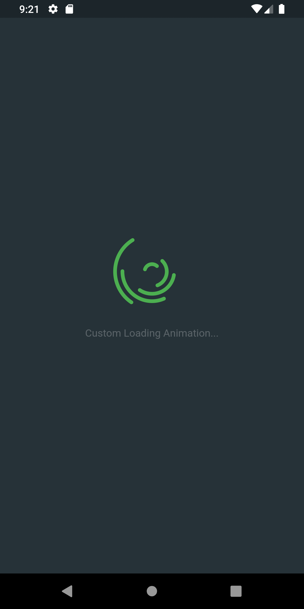

# Flutter Examples

Each page is a Flutter UI or Package Example.

## Development Setup

Clone the repository and run the following commands:

```
flutter pub get
flutter run
```

## Screenshots

### Social Profile


---

### Carousel Slider


---

### Liquid Swipe Pages


---

### Loading Animation


---


## Links

<!--   [Website](https://afgprogrammer.com)-->
-   <!--[Youtube channel](https://youtube.com/afgprogrammer)-->
-   [Twitter](https://twitter.com/https://twitter.com/Sajjad_Theory)
-   [Instagram](https://instagram.com/sajjad.theory)
